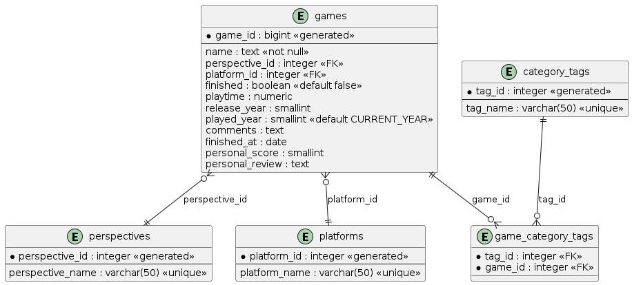

# 🎮 Gaming Database App

A Flask web application for managing and browsing a gaming database, containerized with Docker and powered by PostgreSQL.

---

## 📋 Table of Contents

- [Overview](#overview)
- [Tech Stack](#tech-stack)
- [Project Structure](#project-structure)
- [Prerequisites](#prerequisites)
- [Getting Started](#getting-started)
- [Configuration](#configuration)
- [Database preparation](#database-preparation)
- [Running the App](#running-the-app)
- [Accessing the App](#accessing-the-app)
- [Database](#database)
- [Stopping the App](#stopping-the-app)
- [Development](#development)
- [Troubleshooting](#troubleshooting)

---

## Overview

This application provides a full CRUD interface for managing a gaming library database. It supports browsing, filtering, sorting, and editing games, platforms, perspectives, and category tags.

---

## 🛠 Tech Stack

| Layer      | Technology         |
|------------|--------------------|
| Backend    | Python / Flask     |
| Database   | PostgreSQL 16      |
| ORM        | SQLAlchemy         |
| Templating | Jinja2             |
| Container  | Docker / Compose   |

---

## 📁 Project Structure

```
project/
├── app/
│   ├── Dockerfile
│   ├── app.py
│   ├── requirements.txt
│   └── templates/
│       ├── base.html
│       ├── index.html
│       ├── view_game.html
│       ├── create_game.html
│       ├── edit_game.html
│       ├── search.html
│       ├── platforms.html
│       ├── perspectives.html
│       ├── tags.html
│       └── stats.html
├── docker-compose.yml
├── .env
├── .env.example
├── .gitignore
└── README.md
```

---

## ✅ Prerequisites

Make sure you have the following installed:

- [Docker](https://www.docker.com/get-started) (v20+)
- [Docker Compose](https://docs.docker.com/compose/) (v2+)

Verify your installation:

```bash
docker --version
docker compose version
```

---

## 🚀 Getting Started

### 1. Clone the repository

```bash
git clone https://github.com/thjunge11/simpleFlaskWebApp.git
cd simpleFlaskWebApp
```

### 2. Create your environment file

```bash
cp .env.example .env
```

Edit `.env` with your preferred values:

```bash
nano .env
```

### 3. Build and start the containers

```bash
docker compose up --build
```

---

## ⚙️ Configuration

All configuration is handled through environment variables. Create a `.env` file in the root of the project:

```env
# Database Configuration
DB_HOST=db
DB_NAME=gaming
DB_USER=postgres
DB_PASS=your_secure_password_here
```

### `.env.example`

```env
DB_HOST=db
DB_NAME=gaming
DB_USER=postgres
DB_PASS=changeme
```

> ⚠️ **Never commit your `.env` file to version control.** It is already included in `.gitignore`.

---

## ⚙️ Database preparation
The postgres database structure can be setup with the SQL code in `db_struct_2026-02-24_145629.sql`

### Database structure:



---

## ▶️ Running the App

### Start in foreground (with logs)

```bash
docker compose up --build
```

### Start in background (detached mode)

```bash
docker compose up --build -d
```

### Rebuild after code changes

```bash
docker compose up --build
```

### Start without rebuilding

```bash
docker compose up
```

---

## 🌐 Accessing the App

| Service    | URL                          |
|------------|------------------------------|
| Web App    | http://localhost:5000        |
| PostgreSQL | localhost:**5435**           |

> The PostgreSQL port is mapped to `5435` (instead of the default `5432`) to avoid conflicts with any local PostgreSQL installation.

### Connecting to the database directly

```bash
psql -h localhost -p 5435 -U postgres -d gaming
```

Or using a GUI tool like **DBeaver**, **TablePlus**, or **pgAdmin**:

```
Host:     localhost
Port:     5435
Database: gaming (or your DB_NAME value)
User:     postgres (or your DB_USER value)
Password: your_secure_password_here
```

---

## 🗄️ Database

The PostgreSQL database runs in a separate container with:

- **Persistent storage** via a named Docker volume (`postgres_data_volume`). Your data survives container restarts.
- **Health checks** to ensure the database is ready before the web app starts.
- **Automatic initialization** on first run.

### View running containers

```bash
docker compose ps
```

### Access the database container shell

```bash
docker compose exec db psql -U postgres -d gaming
```

### Backup the database

```bash
docker compose exec db pg_dump -U postgres gaming > backup.sql
```

### Restore the database

```bash
cat backup.sql | docker compose exec -T db psql -U postgres -d gaming
```

---

## 🛑 Stopping the App

### Stop containers (keep data)

```bash
docker compose down
```

### Stop containers and remove volumes (⚠️ deletes all data)

```bash
docker compose down -v
```

---

## 💻 Development

### View logs

```bash
# All services
docker compose logs -f

# Web app only
docker compose logs -f web

# Database only
docker compose logs -f db
```

### Restart a single service

```bash
docker compose restart web
```

### Run a command inside the web container

```bash
docker compose exec web bash
```

### Install new Python packages

1. Add the package to `app/requirements.txt`
2. Rebuild the container:

```bash
docker compose up --build
```

---

## 🔒 Security Notes

- Change the default `DB_PASS` to a strong password before deploying
- Generate a secure Flask `SECRET_KEY`:
  ```bash
  python -c "import secrets; print(secrets.token_hex(32))"
  ```
- Never expose the database port (`5435`) publicly in production
- Use HTTPS in production with a reverse proxy (e.g. nginx)
- Note: ssl_context='adhoc' generates a new cert on every restart, which is fine for local/dev use. For production, you'd want a real cert (e.g., Let's Encrypt via nginx) or mount a persistent cert file into the container.

---

## 🔧 Troubleshooting

### Web app can't connect to database

The web service waits for the database health check to pass before starting. If it still fails:

```bash
# Check database logs
docker compose logs db

# Check if database is healthy
docker compose ps
```

### Port already in use

If port `5000` or `5435` is already in use, change the mapping in `docker-compose.yml`:

```yaml
ports:
  - "5001:5000"   # Change 5000 to another port
```

### Data not persisting

Make sure you are **not** using `docker compose down -v`, as the `-v` flag removes volumes and all stored data.

### Rebuild from scratch

```bash
docker compose down -v
docker compose up --build
```

---

## 📝 License


This project is licensed under the MIT License.

