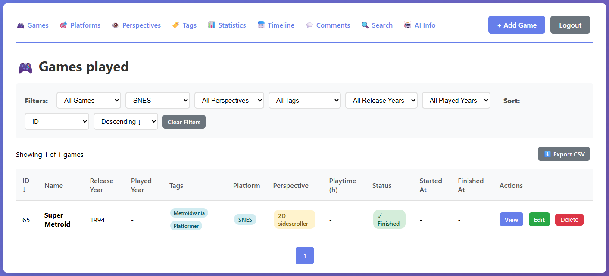
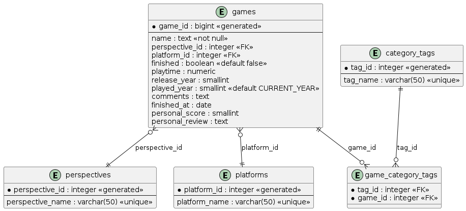

# 🎮 Gaming Database App

A Flask web application for managing and browsing a gaming database, containerized with Docker and powered by PostgreSQL. Features a secure HTTPS reverse proxy via Nginx, Redis caching, user authentication, and AI-powered game info via the Anthropic Claude API.



---

## 📋 Table of Contents

- [Overview](#overview)
- [Tech Stack](#tech-stack)
- [Project Structure](#project-structure)
- [Prerequisites](#prerequisites)
- [Getting Started](#getting-started)
- [Configuration](#configuration)
- [Database Preparation](#database-preparation)
- [Running the App](#running-the-app)
- [Accessing the App](#accessing-the-app)
- [Authentication](#authentication)
- [Database](#database)
- [Redis Caching](#redis-caching)
- [AI Features](#ai-features)
- [Stopping the App](#stopping-the-app)
- [Development](#development)
- [Security Notes](#security-notes)
- [Troubleshooting](#troubleshooting)

---

## Overview

This application provides a full CRUD interface for managing a gaming library database. It supports browsing, filtering, sorting, and editing games, platforms, perspectives, and category tags. The app is served over HTTPS through an Nginx reverse proxy, uses Redis for caching, requires login authentication, and integrates with the Anthropic Claude API for AI-generated game information.

---

## 🛠 Tech Stack

| Layer          | Technology              |
|----------------|-------------------------|
| Backend        | Python / Flask          |
| Database       | PostgreSQL 16           |
| ORM            | SQLAlchemy              |
| Templating     | Jinja2                  |
| Authentication | Flask-Login             |
| Caching        | Redis 7                 |
| Reverse Proxy  | Nginx (HTTPS)           |
| AI Integration | Anthropic Claude API    |
| Container      | Docker / Compose        |

---

## 📁 Project Structure

```
simpleFlaskWebApp/
├── app/
│   ├── Dockerfile
│   ├── app.py
│   ├── requirements.txt
│   └── templates/
│       ├── base.html
│       ├── login.html
│       ├── index.html
│       ├── view_game.html
│       ├── game_info.html
│       ├── create_game.html
│       ├── edit_game.html
│       ├── search.html
│       ├── timeline.html
│       ├── platforms.html
│       ├── create_platform.html
│       ├── edit_platform.html
│       ├── perspectives.html
│       ├── create_perspective.html
│       ├── edit_perspective.html
│       ├── tags.html
│       ├── create_tag.html
│       ├── edit_tag.html
│       ├── comments.html
│       └── stats.html
├── nginx/
│   ├── Dockerfile
│   └── nginx.conf
├── utils/
│   ├── assets/
│   ├── db_struct.sql
│   ├── deploy_to_EC2.md
│   └── ...
├── docker-compose.yaml
├── .env
├── .env.example
├── .gitignore
└── readme.md
```

---

## ✅ Prerequisites

Make sure you have the following installed:

- [Docker](https://www.docker.com/get-started) (v20+)
- [Docker Compose](https://docs.docker.com/compose/) (v2+)

Verify your installation:

```bash
docker --version
docker compose version
```

---

## 🚀 Getting Started

### 1. Clone the repository

```bash
git clone https://github.com/thjunge11/simpleFlaskWebApp.git
cd simpleFlaskWebApp
```

### 2. Create your environment file

```bash
cp .env.example .env
```

Edit `.env` with your preferred values:

```bash
nano .env
```

### 3. Build and start the containers

```bash
# Once — create the shared network
docker network create proxy_net

# Start nginx (can stay running permanently)
docker compose -f docker-compose.nginx.yaml up -d

# Start the app stack
docker compose up -d
```

---

## ⚙️ Configuration

All configuration is handled through environment variables. Create a `.env` file in the root of the project:

```env
# Database Configuration
DB_HOST=db
DB_NAME=gaming
DB_USER=postgres
DB_PASS=your_secure_password_here

# Flask
SECRET_KEY=your_flask_secret_key_here

# Authentication
LOGIN_USERNAME=admin
LOGIN_PASSWORD=your_login_password_here

# Redis (optional overrides; defaults match docker-compose)
REDIS_HOST=redis
REDIS_PORT=6379

# Anthropic Claude AI
ANTHROPIC_API_KEY=your_anthropic_api_key_here
CLAUDE_MODEL=claude-3-5-haiku-20241022
```

### `.env.example`

```env
DB_HOST=db
DB_NAME=gaming
DB_USER=postgres
DB_PASS=changeme
SECRET_KEY=changeme
LOGIN_USERNAME=admin
LOGIN_PASSWORD=changeme
REDIS_HOST=redis
REDIS_PORT=6379
ANTHROPIC_API_KEY=
CLAUDE_MODEL=claude-3-5-haiku-20241022
```

> ⚠️ **Never commit your `.env` file to version control.** It is already included in `.gitignore`.

---

## ⚙️ Database Preparation

The PostgreSQL database structure can be set up with the SQL script found in `utils/db_struct.sql`.

### Database structure:



---

## ▶️ Running the App

### Start in foreground (with logs)

```bash
docker compose up --build
```

### Start in background (detached mode)

```bash
docker compose up --build -d
```

### Rebuild after code changes

```bash
docker compose up --build
```

### Start without rebuilding

```bash
docker compose up
```

---

## 🌐 Accessing the App

| Service    | URL                          |
|------------|------------------------------|
| Web App    | https://localhost            |
| Web App (HTTP, redirects to HTTPS) | http://localhost |
| PostgreSQL | localhost:**5435**           |
| Redis      | localhost:**6379**           |

> Traffic is served over HTTPS via the Nginx reverse proxy. HTTP requests on port 80 are automatically redirected to HTTPS on port 443. The self-signed certificate generated at build time will trigger a browser warning — this is expected for local/dev use.

> The PostgreSQL port is mapped to `5435` (instead of the default `5432`) to avoid conflicts with any local PostgreSQL installation.

### Connecting to the database directly

```bash
psql -h localhost -p 5435 -U postgres -d gaming
```

Or using a GUI tool like **DBeaver**, **TablePlus**, or **pgAdmin**:

```
Host:     localhost
Port:     5435
Database: gaming (or your DB_NAME value)
User:     postgres (or your DB_USER value)
Password: your_secure_password_here
```

---

## 🔐 Authentication

The app requires a login to access any page. Credentials are configured via environment variables:

```env
LOGIN_USERNAME=admin
LOGIN_PASSWORD=your_login_password_here
```

- Visit https://localhost — you will be redirected to the login page automatically.
- After logging in, you will be redirected back to the originally requested page.
- Use the logout link in the navigation bar to end your session.

---

## 🗄️ Database

The PostgreSQL database runs in a separate container with:

- **Persistent storage** via a named Docker volume (`postgres_data_volume`). Your data survives container restarts.
- **Health checks** to ensure the database is ready before the web app starts.
- **Automatic initialization** on first run.

### View running containers

```bash
docker compose ps
```

### Access the database container shell

```bash
docker compose exec db psql -U postgres -d gaming
```

### Backup the database

```bash
docker compose exec db pg_dump -U postgres gaming > backup.sql
```

### Restore the database

```bash
cat backup.sql | docker compose exec -T db psql -U postgres -d gaming
```

---

## ⚡ Redis Caching

Redis is used to cache frequently accessed data and improve response times. It runs as a separate container (`redis:7-alpine`) with:

- **Persistent storage** via a named Docker volume (`redis_data_volume`).
- **Health checks** to ensure Redis is ready before the web app starts.

### View Redis logs

```bash
docker compose logs -f redis
```

### Connect to Redis CLI

```bash
docker compose exec redis redis-cli
```

---

## 🤖 AI Features

The app integrates with the **Anthropic Claude API** to provide AI-generated game information. Set your API key and preferred model in `.env`:

```env
ANTHROPIC_API_KEY=your_anthropic_api_key_here
CLAUDE_MODEL=claude-3-5-haiku-20241022
```

If `ANTHROPIC_API_KEY` is not set, AI-powered features will not be available but the rest of the app will work normally.

---

## 🛑 Stopping the App

### Stop containers (keep data)

```bash
docker compose down
```

### Stop containers and remove volumes (⚠️ deletes all data)

```bash
docker compose down -v
```

---

## 💻 Development

### View logs

```bash
# All services
docker compose logs -f

# Web app only
docker compose logs -f web

# Database only
docker compose logs -f db

# Nginx only
docker compose logs -f nginx

# Redis only
docker compose logs -f redis
```

### Restart a single service

```bash
docker compose restart web
```

### Run a command inside the web container

```bash
docker compose exec web bash
```

### Install new Python packages

1. Add the package to `app/requirements.txt`
2. Rebuild the container:

```bash
docker compose up --build
```

---

## 🔒 Security Notes

- Change the default `DB_PASS` and `LOGIN_PASSWORD` to strong values before deploying.
- Generate a secure Flask `SECRET_KEY`:
  ```bash
  python -c "import secrets; print(secrets.token_hex(32))"
  ```
- Never expose the database port (`5435`) or Redis port (`6379`) publicly in production.
- The Nginx container generates a self-signed TLS certificate at build time (valid for localhost/dev). For production, replace it with a certificate from a trusted CA (e.g., Let's Encrypt).
- Keep your `ANTHROPIC_API_KEY` secret and never commit it to version control.

---

## 🔧 Troubleshooting

### Web app can't connect to database

The web service waits for the database health check to pass before starting. If it still fails:

```bash
# Check database logs
docker compose logs db

# Check if database is healthy
docker compose ps
```

### Web app can't connect to Redis

The web service also waits for the Redis health check. Check Redis logs:

```bash
docker compose logs redis
```

### Port already in use

If port `80`, `443`, or `5435` is already in use, change the mapping in `docker-compose.yaml`:

```yaml
ports:
  - "8080:80"   # Change 80 to another port
  - "8443:443"  # Change 443 to another port
```

### Browser shows a certificate warning

The Nginx container uses a self-signed certificate generated at build time. This is expected for local development. Accept the warning to proceed.

### Data not persisting

Make sure you are **not** using `docker compose down -v`, as the `-v` flag removes volumes and all stored data.

### Rebuild from scratch

```bash
docker compose down -v
docker compose up --build
```

---

## 📝 License

This project is licensed under the MIT License.

