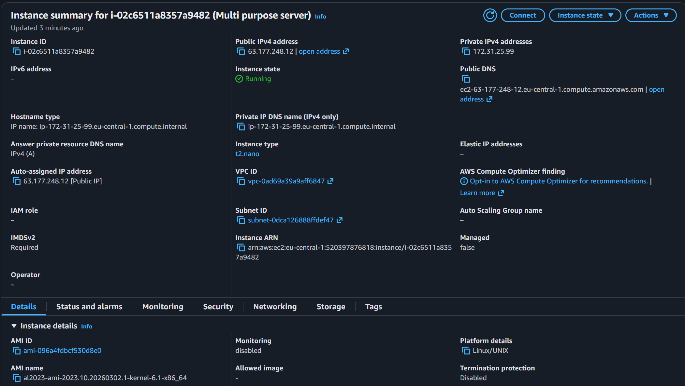

# Howto deploy the App to EC2 instance
- Create EC2 instance on AWS
- chose AMI: Amazon Linux 2 AMI (HVM), SSD Volume Type, instinstance type t2.nano, 8GB storeage, create new key pair and download it

- Configure Security Group: allow SSH (port 22), HTTP (port 80) and port 443 for HTTPS
- Connect to EC2 instance using SSH
- install git and docker with the following commands:
```bash
sudo yum update -y
sudo yum install git -y
sudo install docker -y
sudo service docker start
```
- install docker buildx and compose manually
```bash
sudo curl -L "https://github.com/docker/buildx/releases/latest/download/buildx-v0.8.2.linux-amd64" -o /usr/libexec/docker/cli-plugins/docker-buildx
sudo chmod +x /usr/libexec/docker/cli-plugins/docker-buildx
sudo curl -L "https://github.com/docker/compose/releases/latest/download/docker-compose-linux-x86_64" -o /usr/libexec/docker/cli-plugins/docker-compose
sudo chmod +x /usr/libexec/docker/cli-plugins/docker-compose
```
- Clone the repository and navigate to the project directory:
```bash
git clone <repository_url>
cd <repository_directory>
```
- Build and run the Docker containers using docker-compose:
```bash
sudo docker compose up -d
```
## Initialize the database and restore backup from any existing instance:
- use pg_dump to backup database on the instance by running the following command:
```bash
sudo docker exec -i simpleflaskwebapp-db-1 pg_dump -U postgres -d mydb > gaming_postgresDB.sql
```
- upload local files to EC2 instance using scp command:
```bash
scp -i /path/to/your/key.pem /path/to/local/file.txt ec2-user@<EC2_PUBLIC_IP>:/path/to/remote/directory/
```
- initialize database with the SQL script like: 
```bash
sudo docker exec -i simpleflaskwebapp-db-1 psql -U postgres -d mydb < /path/to/your/gaming_postgresDB.sql
```
- use psql command to connect to the database and run SQL commands:
```bash
sudo docker exec -it simpleflaskwebapp-db-1 psql -U postgres -d mydb
```
